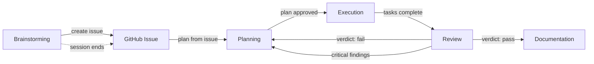

# Nesso Workflow

Structured development flow for Nesso: five phases, each with a dedicated skill, a context slice, and a gate. Not every task needs all five — size the flow to the task.

<EXTREMELY-IMPORTANT>
If you think there is even a 1% chance a skill might apply to what you are doing, you ABSOLUTELY MUST invoke the skill.

IF A SKILL APPLIES TO YOUR TASK, YOU DO NOT HAVE A CHOICE. YOU MUST USE IT.

This is not negotiable. You cannot rationalize your way out of this.
</EXTREMELY-IMPORTANT>

## Skill Contract

This skill owns the **what** and **when**: which phases apply, when to skip, when to stop, session boundaries, routing between phases. Each phase skill owns the **how**: the internal process, checklist, and quality bar for that specific phase.

This separation keeps workflow focused on orchestration and each skill focused on its domain. Do not duplicate routing or boundary logic inside phase skills — reference this skill instead.

## The Five Phases

| Phase            | Skill                            | Output              | Context                                           | Gate                                                   |
| ---------------- | -------------------------------- | ------------------- | ------------------------------------------------- | ------------------------------------------------------ |
| 1. Brainstorming | `brainstorming` + `create-issue` | GitHub issue        | task description, codebase structure, graph model | Human (user approves design)                           |
| 2. Planning      | `planning`                       | Implementation plan | approved issue, codebase, conventions             | Human (user approves plan)                             |
| 3. Execution     | `building`                       | Code + tests        | plan, codebase, test patterns                     | Agent verdict (TDD green) + automated (lint/typecheck) |
| 4. Review        | `nesso-review`                   | Verdict             | diff, plan, constraints                           | Agent verdict (nesso-reviewer) + automated (preflight) |
| 5. Documentation | `verification`                   | Updated docs        | diff, rules, docs/MCP parity                      | Automated (hooks + checks)                             |

### When a review fails → back to Planning

Never patch execution directly. A failed review means the plan needs revision, not the code needs a quick fix. This prevents agentic entropy — drift that accumulates from patch-after-patch without re-examining the design.

### Fix the workflow itself

If you discover a problem with the workflow skills during use — a missing step, a contradiction between skills, a gap in the process, a rule that doesn't hold — **stop and fix it before continuing**.

1. **Show the problem** — which skill, what's wrong, and how it affected the current work
2. **Propose a fix** — the specific change to the skill file
3. **Ask for confirmation** — get approval before editing the skill
4. **Apply the fix** — update the `.claude/skills/` file and continue

The workflow is not frozen. It evolves as we learn what works. But every change goes through the user — no silent edits to the harness.

## Phase Routing

### Brainstorming is always interactive

Brainstorming **must run in the main agent**, never as a subagent. It requires back-and-forth with the user — clarifying questions, design alternatives, approval gates. A subagent cannot hold this conversation.

The output of brainstorming is always a **GitHub issue**, created with the `create-issue` skill. The issue captures the design, scope, and acceptance criteria — it becomes the task description for the planning phase and beyond.

Brainstorming is also a natural **session boundary**. It can:

- **End here** — design the task, create the issue, then stop. The user picks up in a new session and the flow resumes at planning with that issue.
- **Flow into planning** — if the user wants to keep going, the brainstorming skill creates the issue and then hands off to `planning`.

Do not assume brainstorming always leads to immediate implementation. A design session that produces a solid issue is a complete unit of work.

### Non-trivial feature or change

Follow all five phases in order. The flow is mandatory, not advisory.

### Bug fix

Skip brainstorming. Start at **planning** if the root cause is unclear (use `systematic-debugging` first). Go straight to **execution** if the fix is obvious.

### One-line fix, config change, or docs update

Skip brainstorming and planning. Go to **execution**, then **review**. Documentation only if the change affects user-facing docs or MCP.

### Dependency bump, CI tweak, or harness change

Skip brainstorming and planning. Go to **execution**, then **review**. Load `.rules/harness.md` if touching harness files.

## How to Use This Skill

1. **Assess the task** — which phases apply? Size the flow before doing anything.
2. **Invoke the right skill** — use the routing table above. Announce: "Using [skill] to [purpose]".
3. **If the skill does not exist yet** — follow the phase description inline. Check the available skills in AGENTS.md; only invoke skills that are listed as created.
4. **Follow the skill exactly** — if it has a checklist, create a todo per item.
5. **Respect the gate** — do not proceed to the next phase until the gate passes.
6. **Brainstorming always produces an issue** — after the design is approved, invoke `create-issue` to publish it on GitHub. The issue is the handoff artifact. The session can end here or continue to planning.
7. **After review passes** — run verification, then stop. Do not commit or push without explicit consent (AGENTS.md → Git).

## Nesso Constraints

All hard rules live in [AGENTS.md → Constraints](../../AGENTS.md#constraints--hard-rules-never-do-this). Every phase must keep them in mind. Violations are **blocking** — the review gate catches them, but do not create them in the first place.

## Red Flags — Stop, You Are Rationalizing

| Thought                                | Reality                                                                                    |
| -------------------------------------- | ------------------------------------------------------------------------------------------ |
| "This is too simple for brainstorming" | Simple things cause the most wasted work. At minimum, state what you are building and why. |
| "I already know the design"            | Then writing it down takes two minutes. Write it.                                          |
| "I'll just fix this quickly"           | Quick fixes without a plan become quick patches. Plan first.                               |
| "The tests can come after"             | TDD is non-negotiable. Write the failing test first.                                       |
| "I need to explore the codebase first" | Exploration is part of planning, not a substitute for it.                                  |
| "This doesn't need review"             | Every change needs review. The depth scales, not the gate.                                 |
| "I'll just commit this one thing"      | No commits without explicit consent. Every time.                                           |
| "The rules don't apply here"           | They always apply. That is what makes them constraints.                                    |
| "I remember the skill"                 | Skills evolve. Read the current version.                                                   |
| "I know what that means"               | Knowing the concept ≠ using the skill. Invoke it.                                          |

## Context Loading

Each phase needs a different slice of context. Do not load everything upfront:

| Phase         | Load                                           | Do not load                               |
| ------------- | ---------------------------------------------- | ----------------------------------------- |
| Brainstorming | graph model, relation types, existing concepts | test patterns, CI config                  |
| Planning      | conventions, components, store architecture    | test internals, theme details             |
| Execution     | testing rules, relevant area rules             | harness rules, changelog rules            |
| Review        | all constraints (this section), diff           | implementation details of unrelated areas |
| Documentation | docs rules, MCP rules, changelog rules         | store rules, component rules              |

Area rules are in [`.rules/`](../../.rules/) — load on demand when the task touches that area (Touch → update in AGENTS.md). Do not load all upfront.

## Skill Priority

When multiple skills apply, process skills come first — they set the approach, then implementation skills carry it out:

- "Let's build X" → `brainstorming` first, then `planning`, then `building`.
- "Fix this bug" → `systematic-debugging` first, then domain skills.
- "Review my changes" → `nesso-review` (which dispatches preflight + nesso-reviewer + code-review).

## Subagent Dispatch

When this skill (or any skill it routes to) needs to dispatch subagents:

- Use the `task` tool with `subagent_type: "general"` for implementation tasks.
- Use the `task` tool with `subagent_type: "explore"` for codebase exploration.
- Each subagent gets a focused context slice — do not dump the entire codebase into the prompt.
- Track progress in a ledger or todo list to survive context compaction.

## Platform Notes

This skill works identically on Claude and OpenCode. Both discover it from `.claude/skills/workflow/SKILL.md`. Tool mapping:

- "Create a todo" → `todowrite`
- "Dispatch a subagent" → `task` tool
- "Invoke a skill" → `skill` tool
- "Read/edit/create a file" → `read` / `edit` / `write`
- "Run a shell command" → `bash`
- "Search files" → `grep` / `glob`
