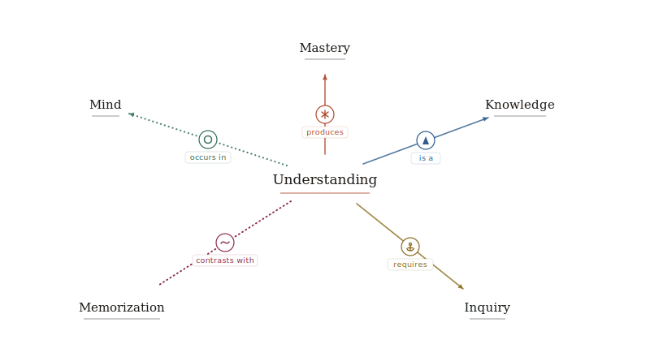

<div align="center">

<picture>
  <source media="(prefers-color-scheme: dark)" srcset="public/icon/nesso-dark.svg">
  
</picture>

# Nesso

**An AI-powered knowledge graph for active learning.**

[](LICENSE)
[](https://www.npmjs.com/package/@nesso-how/mcp)
[](https://github.com/cedoor/nesso/releases)

[Try it](https://app.nesso.how) · [Docs](https://nesso.how) · [Releases](https://github.com/cedoor/nesso/releases) · [MCP package](https://www.npmjs.com/package/@nesso-how/mcp)

</div>

<picture>
  <source media="(prefers-color-scheme: dark)" srcset="docs/public/hero-graph-dark.svg">
  
</picture>

## What it does

Nesso is an interactive concept map where nodes are ideas and edges are typed semantic relations. You draw connections between concepts, pick the relation (e.g. `causes`, `requires`, `subtype-of`), and each concept carries spaced-repetition state. **Socrates**, a Socratic AI mentor, reads the current graph and your selection, then probes your understanding through questions rather than explanations.

## Features

- **Typed knowledge graph** — 41 semantic relations across 8 categories (taxonomic, structural, causal, dependency, temporal, opposition, similarity, epistemic), with inverse pairs; each type has a distinct line style and glyph
- **Socratic AI mentor** — context-aware dialogue that probes rather than explains; opens on the current node or edge
- **Local-first AI** — runs **Qwen2.5 1.5B** in-browser on WebGPU via [`@mlc-ai/web-llm`](https://github.com/mlc-ai/web-llm), no API key needed; any OpenAI-compatible cloud endpoint also works
- **Spaced-repetition review** — FSRS scheduling via [`ts-fsrs`](https://github.com/open-spaced-repetition/ts-fsrs); rate Again / Hard / Good / Easy from a full-screen overlay
- **Multi-graph workspace** — create, name, and switch between graphs; persisted in IndexedDB (web) and mirrored to `.json` files on disk (desktop)
- **Inspector panel** — edit concept text, inspect FSRS state, change relation types in place
- **Localisation** — English and Italian UI; the mentor responds in the active language
- **Cross-platform** — web app at [app.nesso.how](https://app.nesso.how) and a Tauri v2 macOS desktop build

## Architecture

Nesso is a React 18 + Vite + TypeScript single-page app, optionally wrapped by Tauri v2 for a native desktop shell. All app state lives in a single Zustand store ([src/store/graph.ts](src/store/graph.ts)) — components subscribe via selectors with no prop drilling. Graph data persists to **IndexedDB** (web) and is **dual-written to a workspace folder of `.json` files** on desktop (with file watch for external edits); UI chrome to **localStorage**.

The canvas is built on [React Flow](https://reactflow.dev/) with custom `ConceptNode` and `NessoEdge` components ([src/components/](src/components/)); each edge renders its semantic relation as a distinct line style plus an SVG glyph. Every node carries FSRS scheduling fields (`stability`, `difficulty`, `due`, `lastRating`) consumed by the Review overlay.

The AI mentor in [src/llm/](src/llm/) supports two transports behind a unified message shape: a local **WebGPU** engine (Qwen2.5 1.5B) and any **OpenAI-compatible** `chat/completions` endpoint. On every send the system prompt is rebuilt from the live store, so the model always sees the current graph snapshot, selection, and a focal neighbourhood.

The repo is a **pnpm workspace** monorepo. Shared semantic vocabulary lives in [packages/relation-types](packages/relation-types) and is consumed by both the app and an MCP server in [packages/mcp](packages/mcp) that exposes Nesso's relation types and documentation to MCP-capable LLM clients.

```
src/
  components/     UI components — read state via useGraphStore
  store/graph.ts  single Zustand store (nodes, edges, selection, settings)
  llm/            mentor transports (web-llm + OpenAI-compatible fetch)
  data/           edge type registry, palettes, seed graphs
  types/graph.ts  shared TypeScript types
src-tauri/        Tauri v2 Rust shell — conf, capabilities, icons
packages/
  relation-types/ @nesso-how/relation-types — shared semantic vocabulary
  mcp/            @nesso-how/mcp — MCP server for LLM clients
docs/             Starlight site published at nesso.how
```

See **[nesso.how](https://nesso.how)** for installation, usage guides, MCP integration, and the full relation-type reference.

## Packages

| Package                                                                                | Purpose                                                                 |
| -------------------------------------------------------------------------------------- | ----------------------------------------------------------------------- |
| [`@nesso-how/relation-types`](https://www.npmjs.com/package/@nesso-how/relation-types) | Shared semantic relation vocabulary and TypeScript types                |
| [`@nesso-how/mcp`](https://www.npmjs.com/package/@nesso-how/mcp)                       | MCP server exposing Nesso's relation vocabulary and docs to LLM clients |

## Roadmap & contributing

Planned work — image export, mentor chat history, Wikipedia/Wikidata enrichment, importer plugins, and more — is tracked on [GitHub Issues](https://github.com/cedoor/nesso/issues). Bug reports, feature ideas, and PRs are welcome there.

## License

Copyright © 2026 Omar Desogus. Licensed under the [MIT License](https://opensource.org/licenses/MIT) — see [`LICENSE`](LICENSE).
