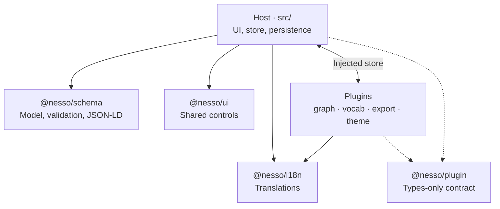

# Nesso

A second brain for connecting ideas and building understanding in one knowledge graph, built on a small core with a simple plugin system.

## Run

Use Node.js 24 and the pnpm version specified in [`package.json`](package.json).

```sh
pnpm install
pnpm dev
```

On macOS, `pnpm desktop` builds and runs the app.

> [!WARNING]
> Downloaded DMGs are not signed or notarized; Gatekeeper may block them.

## Usage

Your knowledge lives in one graph. **Complete graph** always contains every concept.

- **Concepts** represent ideas, connected by directed, typed **relations**.
- **Views** are named subsets of that graph, not copies. Removing a concept from a view does not delete it.
- **Vocabularies** provide relation types; you can also name your own.
- **Plugins** provide the canvas, vocabularies, themes, and export, keeping the core small.

Use the Explorer to navigate views, the canvas to build the graph, and the Inspector to edit the selection and its memberships. The visible graph can be exported as JSON-LD.

> [!NOTE]
> The document and preferences are saved automatically in local storage. There is no cross-device sync; local storage is not a backup.
>
> This is pre-alpha software. Stored formats may change without migrations.

## Architecture


```mermaid
flowchart TD
  Host["Host · src/<br/>UI, store, persistence"]
  Host --> Schema["@nesso/schema<br/>Model, validation, JSON-LD"]
  Host --> UI["@nesso/ui<br/>Shared controls"]
  Host --> I18n["@nesso/i18n<br/>Translations"]
  Host <-->|Injected store| Plugins["Plugins<br/>graph · vocab · export · theme"]
  Plugins --> I18n
  Host -.-> Contract["@nesso/plugin<br/>Types-only contract"]
  Plugins -.-> Contract
```

The host owns state, materializes `viewGraph`, and registers plugins statically. Plugins use the injected store, never host internals. Dashed arrows show the types-only contract.

| Package | Kind | Responsibility |
| --- | --- | --- |
| [`@nesso/schema`](packages/schema/README.md) | Core | Graph model, validation, and JSON-LD. |
| [`@nesso/plugin`](packages/plugin/README.md) | Core | Types-only plugin and store contract. |
| [`@nesso/i18n`](packages/i18n/README.md) | Core | i18next with typed keys, isolated translators, and English fallback. |
| [`@nesso/ui`](packages/ui/README.md) | Core | Shared React controls and styles. |
| [`@nesso/graph`](plugins/graph/README.md) | Plugin | React Flow canvas for the host-provided visible graph. |
| [`@nesso/vocab`](plugins/vocab/README.md) | Plugin | Default relation vocabulary. |
| [`@nesso/export`](plugins/export/README.md) | Plugin | Graph and view export as JSON-LD. |
| [`@nesso/theme`](plugins/theme/README.md) | Plugin | Kernel theme tokens and bundled fonts. |

Host development rules: [`src/AGENTS.md`](src/AGENTS.md).

## Development

Build and checks: `pnpm build`, `pnpm lint`, `pnpm test`, `pnpm analyze`.

Use `pnpm analyze --summary` for a compact Fallow report. Duplication and complexity are advisory.

For macOS development, run `pnpm dev --host 127.0.0.1 --strictPort` and `pnpm desktop:dev` in separate terminals.

`pnpm dist:mac` builds Apple Silicon and Intel DMGs in `release/`. The [release workflow](.github/workflows/release.yml) publishes them from `v*` tags.

### Create a plugin

Build your own renderers, vocabularies, actions, or themes.
See the [plugin guide](packages/plugin/README.md#create-a-plugin) to get started.
