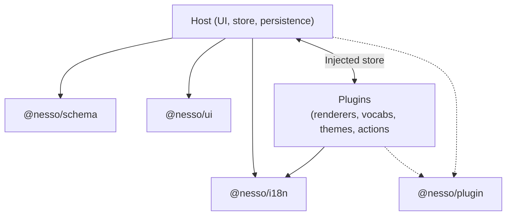

<div align="center">


</br>
A second brain for connecting ideas and building understanding in one knowledge graph, built on a small core with a simple plugin system.
</br></br>

[](https://github.com/nesso-how/nesso/actions/workflows/ci.yml)
[](https://github.com/nesso-how/nesso/releases)

[](https://app.nesso.how)
[](https://nesso.how)
[](https://github.com/nesso-how/nesso/discussions)

</div>

> [!NOTE]
> The previous version of Nesso is available on the [`v0.2-beta` branch](https://github.com/nesso-how/nesso/tree/v0.2-beta).

## Run

Use Node.js 24 and the pnpm version specified in [`package.json`](package.json).

```sh
pnpm install
pnpm dev
```

On macOS, `pnpm desktop` builds and runs the app.

> [!WARNING]
> Older unsigned DMGs may still be blocked by Gatekeeper. The macOS release workflow now requires signing and notarization before publishing.

## Usage

Your knowledge lives in one graph.

- **Concepts** represent ideas, connected by directed, typed **relations**.
- **Views** are named subsets of that graph.
- **Vocabularies** provide relation types. Pou can also name your own.
- **Plugins** provide the canvas, vocabularies, themes, and any actions on the current view.

Use the Explorer to navigate views, the canvas to build the graph, and the Inspector to edit the selection and its memberships.

### AI

In the desktop app, use **AI** with your own provider or a local model, or connect an external assistant through the local MCP server. Provider credentials are encrypted on your device, and chat requests go directly to the chosen endpoint. Graph edits are validated and undoable, with approvals handled inside Nesso.

> [!NOTE]
> This is pre-alpha software. Stored formats may change without migrations.

## Architecture


```mermaid
flowchart TD
  Host["Host (UI, store, persistence)"]
  Host --> Schema["@nesso/schema"]
  Host --> UI["@nesso/ui"]
  Host --> I18n["@nesso/i18n"]
  Host <-->|Injected store| Plugins["Plugins<br/>(renderers, vocabs, themes, actions"]
  Plugins --> I18n
  Host -.-> Contract["@nesso/plugin"]
  Plugins -.-> Contract
```

The host owns state, materializes `viewGraph`, and registers plugins statically. Plugins use the injected store, never host internals. Dashed arrows show the types-only contract.

| Package | Kind | Responsibility |
| --- | --- | --- |
| [`@nesso/schema`](packages/schema/README.md) | Core | Graph model, validation, and JSON-LD. |
| [`@nesso/plugin`](packages/plugin/README.md) | Core | Types-only plugin and store contract. |
| [`@nesso/i18n`](packages/i18n/README.md) | Core | i18next with typed keys, isolated translators, and English fallback. |
| [`@nesso/ui`](packages/ui/README.md) | Core | Shared React controls and styles. |
| [`@nesso/ai`](packages/ai/README.md) | Core | Shared chat and MCP tool contracts, policies, and assistant instructions. |
| [`@nesso/concept-map`](plugins/concept-map/README.md) | Plugin | React Flow canvas for the host-provided visible graph. |
| [`@nesso/base-vocab`](plugins/base-vocab/README.md) | Plugin | Default relation vocabulary. |
| [`@nesso/export`](plugins/export/README.md) | Plugin | Graph and view export as JSON-LD. |
| [`@nesso/kernel`](plugins/kernel/README.md) | Plugin | Kernel theme tokens and bundled fonts. |

## Development

Build and checks: `pnpm build`, `pnpm lint`, `pnpm test`, `pnpm analyze`.

Use `pnpm analyze --summary` for a compact Fallow report. Duplication and complexity are advisory.

For macOS development, run `pnpm dev --host 127.0.0.1 --strictPort` and `pnpm desktop:dev` in separate terminals.

### Create a plugin

Build your own renderers, vocabularies, actions, or themes.
See the [plugin guide](packages/plugin/README.md#create-a-plugin) to get started.
