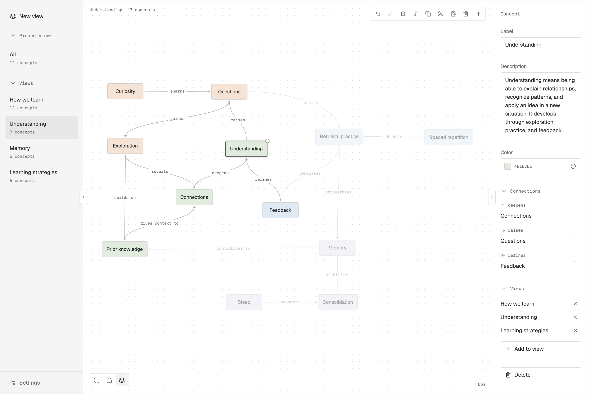
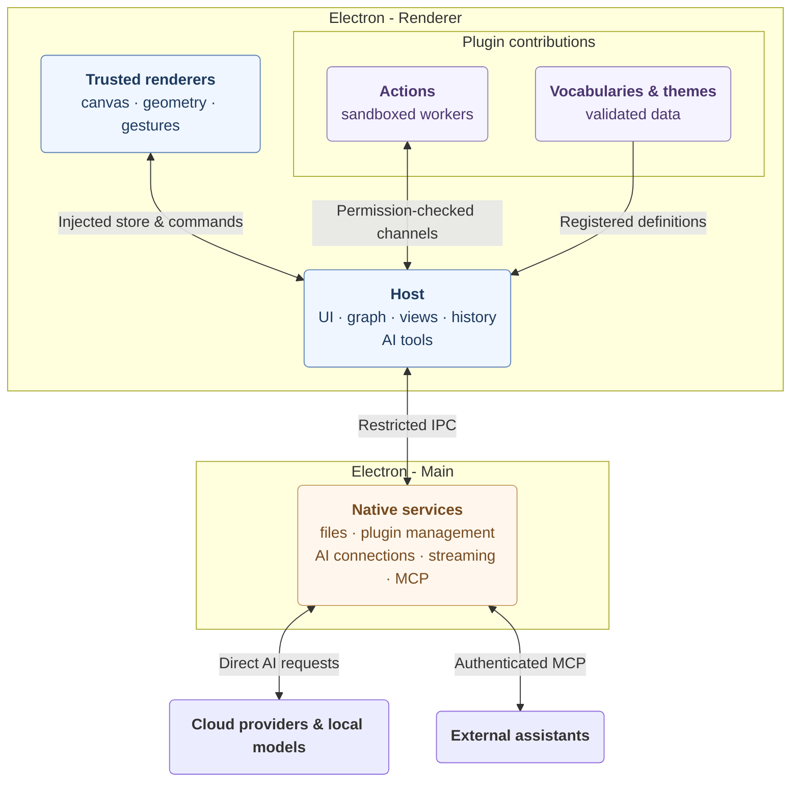

<div align="center">


</br>
A local-first desktop app for connecting ideas and building understanding through a personal knowledge graph.
</br></br>

[](https://github.com/nesso-how/nesso/actions/workflows/ci.yml)
[](https://github.com/nesso-how/nesso/releases)
[](https://github.com/nesso-how/nesso/discussions)

</div>

We often understand and remember through associations: one idea brings another to mind, and new knowledge gains meaning through what we already know. Nesso gives you a place to map these associations, follow the relations between ideas, and build on them.

Your knowledge isn’t scattered across files and folders but lives in **one connected graph that grows with your understanding**. **Views** let you focus on a project, question, or theme without splitting that knowledge into separate copies. The same concept can appear in several views, with edits shared across them.



Nesso keeps things minimal and efficient, with just a few key elements:

- **Concepts** represent ideas. You can change their color, make their labels bold or italic, and add a plain-text description.
- **Relations** connect concepts with a direction and a type that describes the connection.
- **Views** offer different perspectives on the same graph. The default **All** view contains the complete graph and cannot be deleted. Saved views are named subsets of its concepts.
- **Vocabularies** provide relation types. You can name your own relation types or define vocabularies as plugins.
- **Plugins** are npm packages providing vocabularies, themes, or actions on the current view. Install them from Settings → Plugins on desktop, or [create your own](packages/plugin/README.md#create-a-plugin).
- **Review** is a bundled plugin for FSRS spaced repetition over a view’s concepts.
- **AI** helps you explore, expand, and organize your graph on desktop. Chat using your own API key (BYOK), a local model, or ChatGPT sign-in, or connect external assistants through the local MCP server.

Use the Explorer to navigate views, the canvas to build the graph, and the Inspector to edit the selection, manage views, or chat with AI on desktop.

> [!WARNING]
> This is pre-alpha software. Stored formats may change without migrations.
>
> Windows installers are currently unsigned and may trigger SmartScreen warnings.

## Install

Nesso is primarily a desktop app for **macOS, Windows, and Linux**. Download it from [nesso.how](https://nesso.how) or [GitHub releases](https://github.com/nesso-how/nesso/releases).

The [web demo](https://app.nesso.how) lets you try the graph editor in your browser. AI assistance, plugin installation, and the local MCP server are available in the desktop app.

## Architecture


```mermaid
flowchart TB
  subgraph RendererProcess["Electron - Renderer"]
    Canvas("<b>Trusted renderers</b><br/>canvas · geometry · gestures")
    Host("<b>Host</b><br/>UI · graph · views · history<br/>AI tools")

    subgraph Plugins["Plugin contributions"]
      Actions("<b>Actions</b><br/>sandboxed workers")
      Definitions("<b>Vocabularies & themes</b><br/>validated data")
    end

    Canvas <-->|Injected store & commands| Host
    Actions <-->|Permission-checked channels| Host
    Definitions -->|Registered definitions| Host
  end

  subgraph MainProcess["Electron - Main"]
    Desktop("<b>Native services</b><br/>files · plugin management<br/>AI connections · streaming · MCP")
  end

  Host <-->|Restricted IPC| Desktop
  Desktop <-->|Direct AI requests| Models("<b>Cloud providers & local models</b>")
  Desktop <-->|Authenticated MCP| Assistants("<b>External assistants</b>")

  classDef core fill:#eff6ff,stroke:#6082b6,color:#1e3a5f
  classDef extension fill:#f5f3ff,stroke:#9380b8,color:#4c3670
  classDef desktop fill:#fff7ed,stroke:#c49a64,color:#784b20
  class Canvas,Host core
  class Actions,Definitions extension
  class Desktop desktop
```

Nesso is organized around a small core, trusted renderers, and plugins:

- **Core** owns application state and editing rules.
- **Renderers** handle graph presentation and gestures.
- **Plugins** contribute actions, vocabularies, and themes through explicit contracts.

On desktop, these run in Electron’s renderer process, while the main process handles native services such as file access, plugin management, AI credentials, and provider connections.

All graph edits go through one API: `applyOperations`. The UI, trusted renderers, AI tools, and plugin actions submit ordered batches, directly or through convenience helpers built on the same API. The host validates each complete batch before publishing a single atomic update: either the changes succeed together, or state and history remain unchanged. Plugin permissions are checked before operations reach this shared editing path.

The same mechanism supports efficient, delta-based undo and redo. History records only what changed instead of storing a full copy of the graph for every edit. AI-generated edits also use this shared history and can be undone or redone just like manual changes.

### Plugins

Plugins are central to Nesso’s design. They let the project grow through community contributions, adding new capabilities while keeping the core small and focused.

Plugins contribute actions, vocabularies, and themes. Actions run in isolated workers or open plugin-owned interactive UI in a sandboxed central panel, using permission-checked APIs for graph operations and private storage scoped to each plugin and document. The host owns panel navigation and lifecycle, storage persistence, and concept-orphan cleanup separately from graph data and history. Vocabularies and themes are validated data and require no executable code.

The [plugin SDK](packages/plugin/) provides TypeScript contracts, validation, and clients for building plugins. Bundled and external plugins use the same contracts and runtime.

For a complete action package you can build and install, see the [standalone plugin example](packages/plugin/example/).

### AI

AI in Nesso is a supporting tool, not a replacement for the process of learning and building knowledge. It can help you explore ideas, find connections, and organize your graph, while you remain responsible for questioning, understanding, and deciding what belongs in it.

On desktop, chat with your own API key (BYOK), a local model, or ChatGPT sign-in, or connect an external assistant through the local MCP server. Provider credentials are encrypted on your device, and requests go directly to the chosen endpoint. Graph edits are validated and undoable.

## Code organization

The app lives in `src/`, with desktop services in `electron/`. Shared packages live in `packages/`: **Core** packages provide contracts and reusable building blocks, while **Renderer** packages provide trusted graph interfaces. Bundled **Plugin** packages live in `plugins/` and deliberately use the same contracts as external plugins, so Nesso tests those contracts through its own everyday features before others build on them.

| Package                                            | Kind     | Responsibility                                                            |
| -------------------------------------------------- | -------- | ------------------------------------------------------------------------- |
| [`@nesso-how/schema`](packages/schema/)            | Core     | Graph model, validation, and JSON-LD.                                     |
| [`@nesso-how/core`](packages/core/)                | Core     | Shared state, operation and store contracts, and write helpers.           |
| [`@nesso-how/plugin`](packages/plugin/)            | Core     | Plugin contracts, validation, and asynchronous clients.                   |
| [`@nesso-how/errors`](packages/errors/)            | Core     | Shared structured errors with issue paths and messages.                   |
| [`@nesso-how/i18n`](packages/i18n/)                | Core     | i18next with typed keys, isolated translators, and English fallback.      |
| [`@nesso-how/ui`](packages/ui/)                    | Core     | Shared React controls and styles.                                         |
| [`@nesso-how/ai`](packages/ai/)                    | Core     | Shared chat and MCP tool contracts, policies, and assistant instructions. |
| [`@nesso-how/concept-map`](packages/concept-map/)  | Renderer | Trusted React Flow canvas for the host-provided visible graph.            |
| [`@nesso-how/base-vocab`](plugins/base-vocab/)     | Plugin   | Default relation vocabulary.                                              |
| [`@nesso-how/export`](plugins/export/)             | Plugin   | Graph and view export as JSON-LD.                                         |
| [`@nesso-how/import`](plugins/import/)             | Plugin   | Merge a Nesso JSON-LD file into the current graph.                        |
| [`@nesso-how/review`](plugins/review/)             | Plugin   | Isolated concept review with FSRS and private concept-scoped progress.    |
| [`@nesso-how/kernel-theme`](plugins/kernel-theme/) | Plugin   | Kernel theme tokens and bundled fonts.                                    |
| [`@nesso-how/paper-theme`](plugins/paper-theme/)   | Plugin   | Warm ivory surfaces and restrained terracotta accents.                    |
| [`@nesso-how/mist-theme`](plugins/mist-theme/)     | Plugin   | Cool misty blue surfaces and steel blue accents.                          |

## Development

Use Node.js 24 and the pnpm version specified in [`package.json`](package.json). Install dependencies, then build and run the desktop app:

```sh
pnpm install
pnpm desktop
```

For desktop development with live reload, run `pnpm dev --host 127.0.0.1 --strictPort` and `pnpm desktop:dev` in separate terminals. For the web demo alone, use `pnpm dev`.

Checks: `pnpm build`, `pnpm lint`, `pnpm test`, `pnpm test:plugin-runtime`, and `pnpm analyze --summary`.

See the [plugin guide](packages/plugin/README.md#create-a-plugin) for plugin authoring, or `pnpm release --help` for release options.

## Troubleshooting

If a suspected plugin problem prevents startup, quit Nesso completely and relaunch it with `--safe-plugins`:

- **macOS:** `open -a Nesso --args --safe-plugins`
- **Windows (PowerShell):** `& "C:\path\to\Nesso.exe" --safe-plugins`
- **Linux:** `nesso --safe-plugins`, or `./Nesso-<version>-<arch>.AppImage` for an AppImage.

Installed packages and documents are preserved. Quit and relaunch without the flag to resume normal operation.

## License

[MIT](LICENSE) © 2026 Omar Desogus and Paolo Manfredotti.
